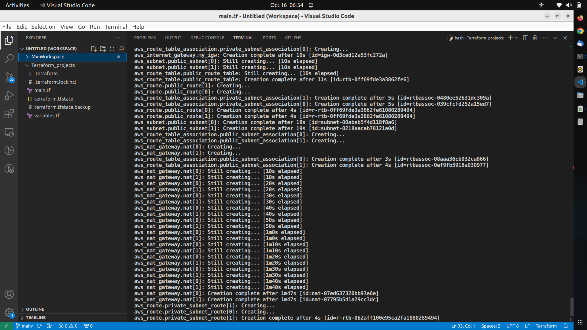

## Virtual Private Cloud (VPC), Private and Public Subnets Provisioning
This code creates a VPC with two public and two private subnets in different Availability Zones, sets up an internet gateway for the public subnets to access the internet and network address translation gateways for the private subnets, and associates route tables accordingly. Make sure you have the AWS CLI configured with the necessary credentials before running this code.
```
# Define the AWS provider configuration
provider "aws" {
  region = "us-east-1"  # Change this to your desired AWS region
}

# Create a VPC
resource "aws_vpc" "my_vpc" {
  cidr_block = "10.0.0.0/16"  # Define the VPC CIDR block
  enable_dns_support = true
  enable_dns_hostnames = true
  tags = {
    Name = "MyVPC"  # Custom VPC name
  }
}

# Define subnets
locals {
  public_subnet_cidr = ["10.0.1.0/24", "10.0.2.0/24"]  # Public subnet CIDR blocks
  private_subnet_cidr = ["10.0.3.0/24", "10.0.4.0/24"]  # Private subnet CIDR blocks
  availability_zones = ["us-east-1a", "us-east-1b"]  # Availability zones
}

# Create public subnets in different Availability Zones
resource "aws_subnet" "public_subnet" {
  count = 2
  vpc_id = aws_vpc.my_vpc.id
  cidr_block = local.public_subnet_cidr[count.index]
  availability_zone = local.availability_zones[count.index]
  map_public_ip_on_launch = true
  tags = {
    Name = "Public-Subnet-${count.index}"  # Custom public subnet name
  }
}

# Create private subnets in different Availability Zones
resource "aws_subnet" "private_subnet" {
  count = 2
  vpc_id = aws_vpc.my_vpc.id
  cidr_block = local.private_subnet_cidr[count.index]
  availability_zone = local.availability_zones[count.index]
  tags = {
    Name = "Private-Subnet-${count.index}"  # Custom private subnet name
  }
}

# Create an internet gateway to allow the public subnets to access the internet
resource "aws_internet_gateway" "my_igw" {
  vpc_id = aws_vpc.my_vpc.id
  tags = {
    Name = "MyIGW"  # Custom Internet Gateway name
  }
}

# Create a route table for public subnets
resource "aws_route_table" "public_route_table" {
  vpc_id = aws_vpc.my_vpc.id
  tags = {
    Name = "Public-Subnet-Route-table"  # Custom route table for public subnets name 
  }
}

# Create a route to send traffic to the internet gateway for public subnets
resource "aws_route" "public_route" {
  count = 2
  route_table_id = aws_route_table.public_route_table.id
  destination_cidr_block = "0.0.0.0/0"  # Route all traffic to the internet
  gateway_id = aws_internet_gateway.my_igw.id
  
}

# Associate the public route table with the public subnets
resource "aws_route_table_association" "public_subnet_association" {
  count = 2
  subnet_id = aws_subnet.public_subnet[count.index].id
  route_table_id = aws_route_table.public_route_table.id
}

# Create a route table for private subnets
resource "aws_route_table" "private_route_table" {
  vpc_id = aws_vpc.my_vpc.id
}

# Associate the private route table with the private subnets
resource "aws_route_table_association" "private_subnet_association" {
  count = 2
  subnet_id = aws_subnet.private_subnet[count.index].id
  route_table_id = aws_route_table.private_route_table.id
}

# Create a Network Address Translation (NAT) gateway for private subnets
resource "aws_nat_gateway" "nat" {
  count = 2
  allocation_id = aws_eip.nat_eip[count.index].id
  subnet_id = aws_subnet.public_subnet[count.index].id
}

# Create an Elastic IP for each NAT gateway
resource "aws_eip" "nat_eip" {
  count = 2
}

# Add a default route for the private subnets to the NAT gateway
resource "aws_route" "private_subnet_route" {
  count = 2
  route_table_id = aws_route_table.private_route_table.id
  destination_cidr_block = "0.0.0.0/0"
  nat_gateway_id = aws_nat_gateway.nat[count.index].id
}

```
### Terraform Plan and Apply
Use the Terraform extension in VSCode or the terminal to run `terraform plan` and `terraform apply` to create and manage your AWS resources.

