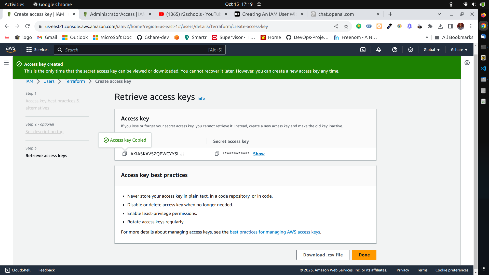
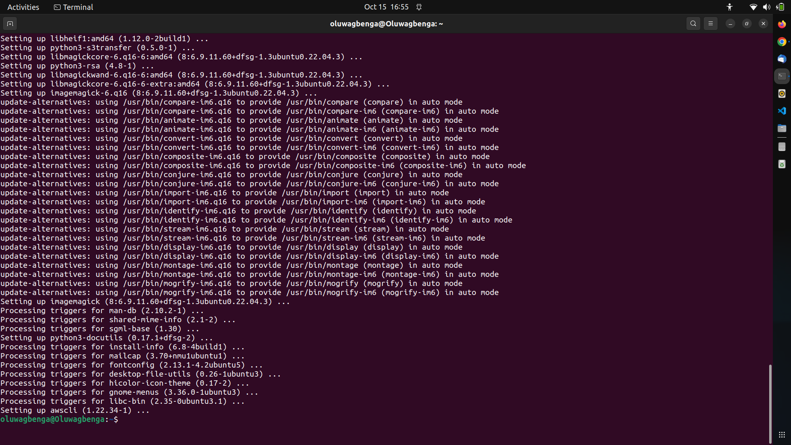
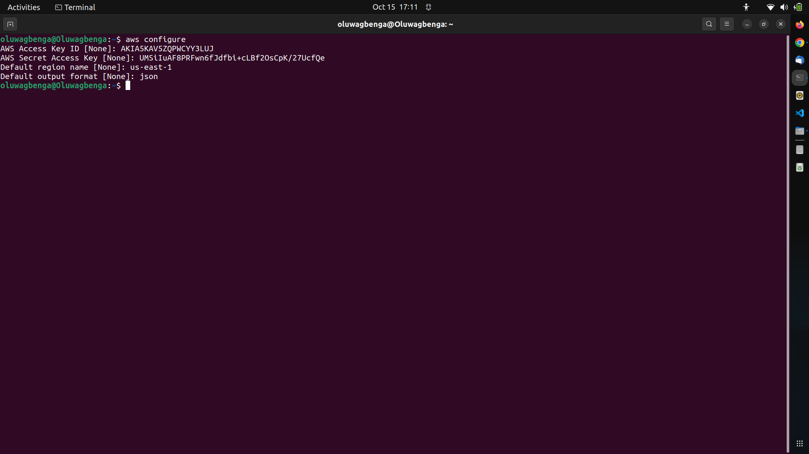
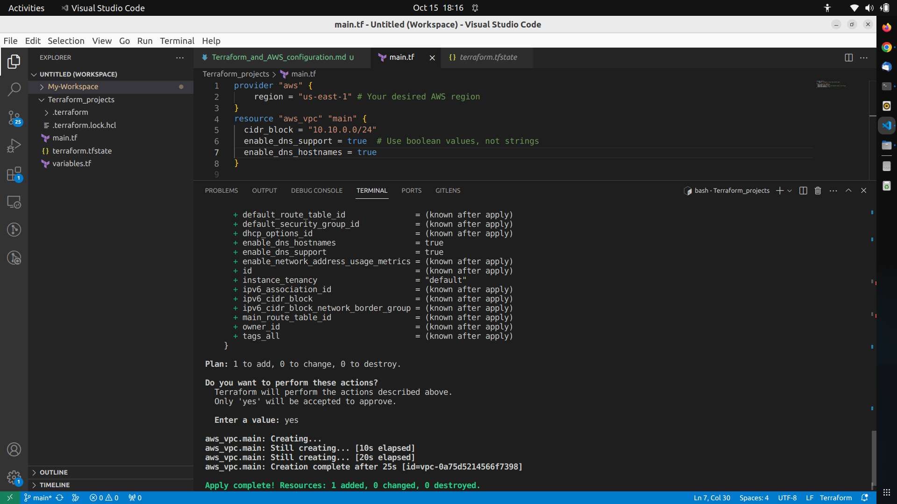

## Terraform Configuration on Ubuntu 22.04
To connect Terraform with your AWS account and integrate it with VSCode, you'll need to follow these steps:

### AWS Account Setup
f you haven't already, create an AWS account. Make sure you have your AWS Access Key ID and Secret Access Key ready. You can create these keys in the AWS Management Console under IAM (Identity and Access Management).

### nstall Terraform
Ensure that terraform is correctly installed on your Ubuntu system.

### AWS CLI Installation and Configuration**:
If you haven't already, install the AWS CLI on your Ubuntu system. You can do this using the following commands:
```
sudo apt update
sudo apt install awscli
```


Configure the AWS CLI with your Access Key ID and Secret Access Key:
```
aws configure
``````
Follow the prompts to enter your AWS Access Key ID, Secret Access Key, default region, and output format.



### Install the Terraform Extension for VSCode
If you haven't already, install the Terraform extension for Visual Studio Code. Open VSCode, go to the Extensions view (Ctrl+Shift+X), and search for "Terraform." Install the official Terraform extension from HashiCorp.

### Open a Terraform Project
Open the directory where you have your Terraform project (your `.tf` configuration files) in VSCode.

### Initialize Terraform
- Open a terminal in VSCode (Ctrl+`) and navigate to your Terraform project directory.
- Run `terraform init` to initialize the project. This will download the necessary providers and modules.

### Author Your Terraform Configuration
Create or edit your `.tf` configuration files to define your AWS infrastructure resources.

### Configure AWS Provider in Terraform
In your `.tf` files, configure the AWS provider with your AWS credentials. You can do this by adding the following code at the beginning of your configuration:
```
provider "aws" {
    region = "us-east-1" # Your desired AWS region
}
resource "aws_vpc" "main" {
  cidr_block = "10.10.0.0/24"
  enable_dns_support = true  # Use boolean values, not strings
  enable_dns_hostnames = true
}

```

### Terraform Plan and Apply
Use the Terraform extension in VSCode or the terminal to run `terraform plan` and `terraform apply` to create and manage your AWS resources.

