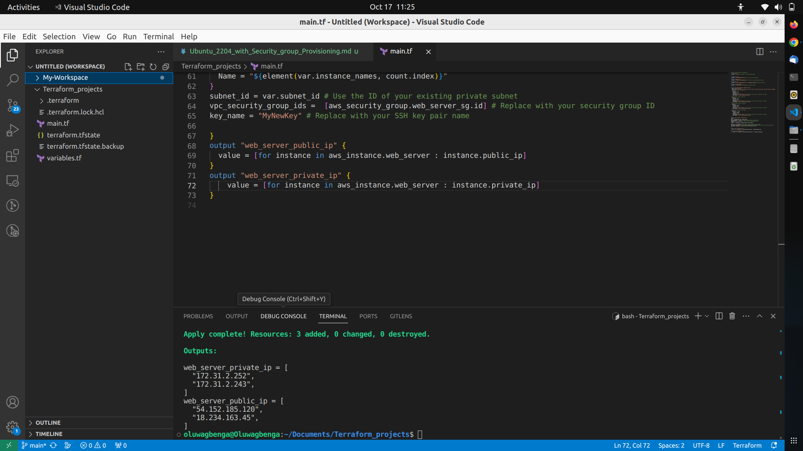

## Virtual Private Cloud (VPC), Private and Public Subnets Provisioning
This script provisions two AWS instances, one running Ubuntu 22.04 and the other Red Hat Enterprise Linux 9. It also sets up a security group permitting access on ports 22 (SSH), 80 (HTTP), 443 (HTTPS), and 3306 (MYSQL). Each resource is named appropriately, and the public and private IP addresses of the created instances are provided for future use. Before executing this script, ensure that you've configured the AWS CLI with the required credentials.
```
# Define the AWS Provider Configuration
provider "aws" {
  region = "us-east-1" # Change to your desire AWS region
}

variable "vpc_id" {
  default = "vpc-0adc738078cff33cc" # The ID of the existing VPC
}
variable "subnet_id" {
  default = "subnet-0a6cf669303b14138" # The ID of the existing private subnet
}
variable "ami" {
  default = ["ami-053b0d53c279acc90", "ami-026ebd4cfe2c043b2"] #Instances ami-id's
}
variable "instance_names" {
  default = ["web_server", "nsf_server",] # Instance names
}

resource "aws_security_group" "web_server_sg" {
  name = "web_server_sg"
  description = "This security group will allow traffic from the follow ports SSH, HTTP, HTTPS, and MYSQL"
  # Allow SSH traffic on port 22 
  ingress {
    from_port = 22
    to_port = 22
    protocol = "tcp"
    cidr_blocks = ["0.0.0.0/0"] # You may want to restrict this to specific IP ranges
    description = "Allow incoming SSH traffic"
  } 
  # Allow HTTP traffic on port 80
  ingress {
    from_port = 80
    to_port = 80
    protocol = "tcp"
    cidr_blocks = ["0.0.0.0/0"] # You may want to restrict this to specific IP ranges
    description = "Allow incoming HTTP traffic"
  }
  # Allow HTTPS traffic on port 443
  ingress {
    from_port = 443
    to_port = 443
    protocol = "tcp"
    cidr_blocks = ["0.0.0.0/0"] # You may want to restrict this to specific IP ranges
    description = "Allow incoming HTTPS traffic"
  }
  # Allow SQL traffic on port 3306
  ingress {
    from_port = 3306
    to_port = 3306
    protocol = "tcp"
    cidr_blocks = ["0.0.0.0/0"] # You may want to restrict this to specific IP ranges
    description = "Allow incoming MYSQL traffic"
  }
}
resource "aws_instance" "web_server" {
count = 2
ami = "${element(var.ami, count.index)}"
instance_type = "t2.micro" # Change to your desired instance type
associate_public_ip_address = true # Enable auto-assign public IP
tags = {
  Name = "${element(var.instance_names, count.index)}"
}
subnet_id = var.subnet_id # Use the ID of your existing private subnet
vpc_security_group_ids =  [aws_security_group.web_server_sg.id] # Replace with your security group ID
key_name = "MyNewKey" # Replace with your SSH key pair name

}
output "web_server_public_ip" {
  value = [for instance in aws_instance.web_server : instance.public_ip]
}
output "web_server_private_ip" {
    value = [for instance in aws_instance.web_server : instance.private_ip]
}

```
### Terraform Plan and Apply
Use the Terraform extension in VSCode or the terminal to run `terraform plan` and `terraform apply` to create and manage your AWS resources.

