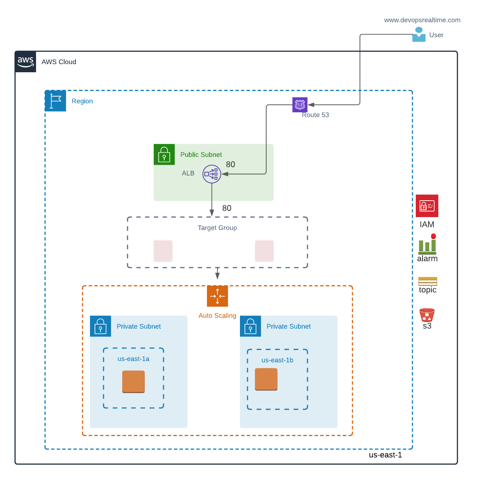

## Deploy Apache Web Server using Terraform IaC

### Objective
The aim of this endeavor is to create Terraform Infrastructure as Code (IaC) to initiate the deployment of an Apache Webserver on the AWS cloud.

### Pre-Requisites
* Create below resources using  Terraform IaC
* Create S3 Bucket to store the terraform statefiles
* Create DynamoDB
* Deploy VPC Network using Terrafom IaC and keep the state file in S3 backend.
* Create below resources using Terraform IaC and keep the state file in S3 backend
* S3 Bucket to store the webserver configuration and PUT  apache_server.sh  script file which will configure webserver
* SNS topic for notifications
* IAM Role
* Golden AMI

### Deployment
Write Terraform IaC to deploy below resources in the VPC that was created in the Pre-Requisites step and keep the state file in S3 backend with state locking support.

Create  IAM Role granting PUT/GET  access to S3 Bucket and Session Manager access.

Create Launch Configuration with userdata script to pull the use-data.sh file from S3 and attach IAM role and [user-data.sh will configure the webserver]

Create Auto Scaling Group with Min:1 Max: 1 Des: 1  in private subnet

Create Target Group with health checks to and attach with Auto Scaling Group

Create Application Load balancer in public subnet and configure Listener Port to route the traffic to the Target Group

Create alias record in Hosted Zone to route the traffic to the Load balancer from public network.

Create Cloudwatch Alarms to send notification when ASG state changes.

Create Scaling Policies to scale out/Scale In when average CPU utilization is > 80%

Deploy Terraform IaC to create the resources

### Validation
Login to AWS Console and verify all the resources are deployed. Access the web application from public internet browser using the domain name.

### Destroy
Destroy the resources once the testing is over to save the billing.

_If not confident, Repeat the steps again. Good Luck.  Comment here with your Bitbucket repo link to review the code._
